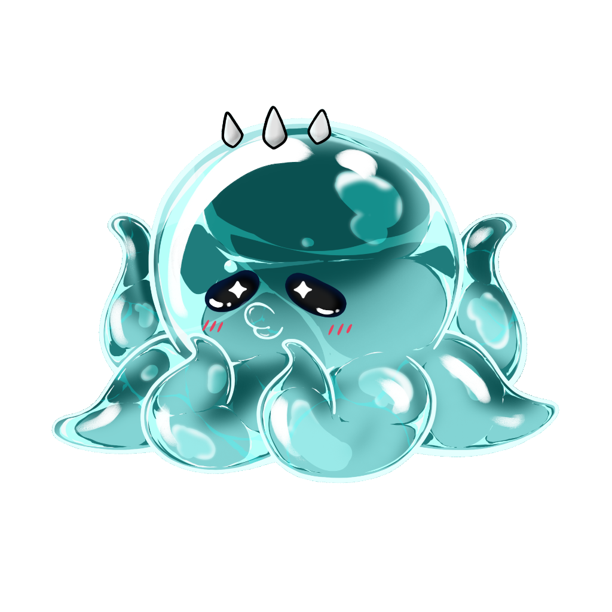
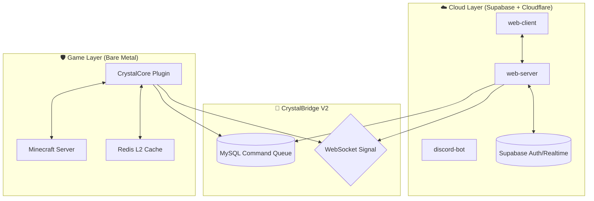

<p align="center">
  
</p>

# <p align="center">💎 CrystalTides 🌊</p>

<p align="center">
  <strong>The Ultimate Minecraft SMP Ecosystem</strong><br/>
  <i>High-fidelity Web Portal • Scalable Express API • Native Tauri v2 Launcher • Seamless Game Integration</i>
</p>

<p align="center">
  <a href="./package.json"></a>
  <a href="./apps/web-client/README.md"></a>
  <a href="./apps/web-server/README.md"></a>
</p>

---

## ✨ Features Highlights

| | |
| :--- | :--- |
| 🌐 **Modern Web Experience** | React 19 + Vite 6 + Tailwind 4. Premium UI with Glassmorphism, 3D skin previews, and micro-animations. |
| 🌉 **CrystalBridge V2** | Real-time command execution (<50ms) using a hybrid WebSocket/SQL queue architecture. No RCON required. |
| 🎰 **Secure Gacha System** | Advanced visual gacha with server-side validation and secure roll logic. |
| 🛡️ **Staff Master Hub** | Interactive Kanban boards, task synchronization, and staff management tools. |
| 🦋 **Native Launcher** | Cross-platform desktop client built with Tauri v2 (React + Rust) with custom installer & uninstaller. |

## 🛠️ Tech Stack

<p align="center">
  
</p>

---

## 🏗️ Architecture Overview



## 🧩 Repo Structure

- **`apps/web-client`**: Modern dashboard for users & staff.
- **`apps/web-server`**: Cloud orchestrator & command bridge.
- **`apps/launcher/`**: Native desktop suite (Tauri v2 + React + Rust).
  - **`client/`**: CrystalTides Launcher — main desktop client.
  - **`installer/`**: CTLauncher Installer — custom branded installer.
  - **`uninstaller/`**: CTLauncher Uninstaller — clean removal tool.
- **`apps/game-bridge/`**: Native Rust bridge for real-time game integration.
- **`plugins/crystalcore`**: Java plugin for the Minecraft core.
- **`packages/shared`**: Shared types and utilities across the monorepo.

## 🚀 Getting Started

1. **Clone the repo with submodules**:
   ```bash
   git clone --recurse-submodules https://github.com/UltraXn/CrystalTidesSMP-Project.git
   ```
2. **Setup environment**:
   Install root dependencies and start the dev environment:
   ```bash
   npm install
   npm run dev
   ```
3. **Launcher development** (requires [Rust](https://rustup.rs/)):
   ```bash
   cd apps/launcher/client
   npx tauri dev
   ```
4. **Configure Submodules**:
   Ensure all submodules are updated:
   ```bash
   git submodule update --init --recursive
   ```

---

## 🗺️ Roadmap 2026
- [x] **CrystalBridge V2** (WebSocket + SQL)
- [x] **KilluCoin Gacha** (Secure Backend)
- [/] **Live Activity Feed** ("The Pulse")
- [ ] **3D Integrated Map** (BlueMap Dashboard)

<p align="center">
  <i>Built with ❤️ for the CrystalTides Community. Powered by Turbo & Supabase.</i>
</p>
