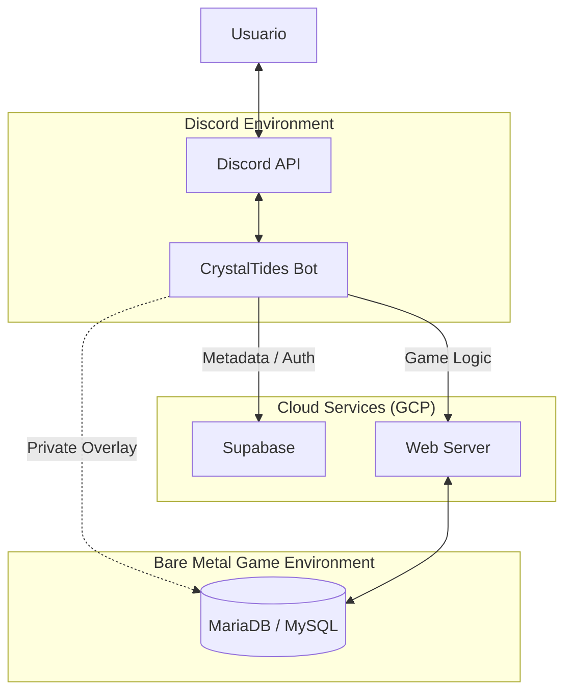

# 🤖 CrystalTides Discord Bot

> **The community bridge between Discord and the CrystalTides universe.**


## 💎 Overview

El **CrystalTides Discord Bot** es el eje social y de vinculación del ecosistema. Construido con **Discord.js** y ejecutado sobre el runtime de **Bun**, este bot gestiona la identidad de los jugadores a través de múltiples plataformas, automatiza la moderación y proporciona herramientas de consulta rápida para la comunidad.

---

## 🌟 Core Features

- 🔗 **Account Linking**: Flujo automatizado de vinculación `/link` (Discord <-> Minecraft <-> Web).
- 📢 **Live Notifications**: Anuncios en tiempo real de eventos del servidor y actualizaciones.
- 🛠️ **Staff Utilities**: Herramientas integradas para moderación y gestión de tickets.
- 📊 **Server Status**: Comandos para consultar el estado del servidor, jugadores online y estadísticas.
- ⚡ **High Performance**: Optimizado para baja latencia usando **Bun** como motor de ejecución.

---

## 🏗️ Architecture Role

El bot actúa como un cliente de orquestación social, comunicándose con el stack web y (bajo demanda) con el entorno de juego:



> [!TIP]
> **Estrategia de Evolución**: Estamos migrando toda la lógica directa de base de datos (`SQL`) hacia el `web-server` para centralizar la seguridad y el rendimiento.

---

## 🛠️ Tech Stack

| Componente  | Tecnología                           | Propósito                              |
| :---------- | :----------------------------------- | :------------------------------------- |
| **Engine**  | [Bun](https://bun.sh)                | Runtime de alto rendimiento para JS/TS |
| **Library** | [Discord.js](https://discord.js.org) | Interacción con la API de Discord      |
| **Logic**   | TypeScript                           | Robustez y escalabilidad del código    |
| **Backend** | Supabase & Web Server                | Fuentes de verdad y lógica de negocio  |

---

## 🚀 Desarrollo & Despliegue

### 🛠️ Entorno Local

1.  **Instalar dependencias:**
    ```bash
    bun install
    ```
2.  **Correr en desarrollo:**
    ```bash
    bun run src/index.ts
    ```
3.  **Registro de comandos:**
    ```bash
    bun run src/deploy-commands.ts
    ```

### 🔐 Configuración (.env)

| Variable            | Descripción                                         |
| :------------------ | :-------------------------------------------------- |
| `DISCORD_TOKEN`     | Token secreto del bot desde el portal de Discord    |
| `DISCORD_CLIENT_ID` | ID de aplicación del bot                            |
| `DISCORD_GUILD_ID`  | ID del servidor principal (para comandos de testeo) |
| `API_BASE_URL`      | Endpoint del Web Server de CrystalTides             |

---

## 🗺️ Future Roadmap

- [ ] **Interactive Status Embeds**: Mensajes dinámicos que se actualizan cada minuto con el estado del servidor.
- [ ] **SpacetimeDB Integration**: Suscripción a eventos globales para notificaciones instantáneas de muertes, logros o eventos.
- [ ] **AI-Powered Support**: Integración con un modelo de IA para responder dudas básicas de los jugadores.

---

> [!NOTE]
> Este bot es parte del ecosistema oficial de **CrystalTides**. Cualquier contribución debe alinearse con las [Guías Generales del Proyecto](../../projects/README.md).
