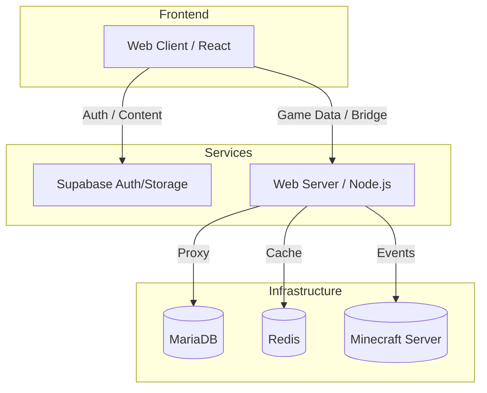

# 🌐 CrystalTides Web Client

> **The digital portal to the CrystalTides universe.**


## 💎 Overview

El **CrystalTides Web Client** es la interfaz principal del ecosistema para jugadores y staff. Construido sobre **React** y **Vite**, ofrece una experiencia de navegación fluida, reactiva y visualmente impactante, integrando datos del juego en tiempo real con una gestión de usuarios robusta.

---

## 🌟 Core Features

- 👤 **Dynamic Profiles**: Visualización detallada de progreso, inventarios y estadísticas de juego.
- 🛡️ **Staff Hub**: Panel administrativo para moderación, gestión de tickets y herramientas de orquestación.
- 🔗 **Account Linking**: Sistema de vinculación segura entre Discord, Minecraft y la web.
- 📉 **Real-time Analytics**: Monitoreo en vivo del estado del servidor y actividad de los jugadores.
- 🎨 **High-End UI**: Diseño premium con soporte nativo para dark mode y micro-animaciones.

---

## 🏗️ Architecture & Data Principles

Para mantener la seguridad y el rendimiento, el cliente sigue una topología de datos estrictamente desacoplada:



> [!IMPORTANT]
> **Data Isolation**: El cliente web **nunca** se conecta directamente a la base de datos MariaDB o Redis del juego. Todo el flujo de datos de Minecraft pasa obligatoriamente por el `web-server`.

---

## 🛠️ Tech Stack

| Componente | Tecnología | Propósito |
| :--- | :--- | :--- |
| **Framework** | [React](https://reactjs.org) | UI Basada en componentes |
| **Build Tool** | [Vite](https://vitejs.dev) | Desarrollo ultra rápido |
| **Styling** | Vanilla CSS / Framer Motion | Estética y Animaciones |
| **State** | React Query / Zustand | Sincronización de estado |
| **Backend** | Supabase / Node.js | Identidad y APIs de soporte |

---

## 🚀 Desarrollo & Despliegue

### 🛠️ Entorno Local

1.  **Instalar dependencias:**
    ```bash
    npm install
    ```
2.  **Correr en desarrollo:**
    ```bash
    npm run dev -w @crystaltides/client
    ```
3.  **Build de producción:**
    ```bash
    npm run build -w @crystaltides/client
    ```

### 🔐 Variables de Entorno (.env)

| Variable | Descripción |
| :--- | :--- |
| `VITE_API_URL` | Endpoint del Web Server |
| `VITE_SUPABASE_URL` | URL de Supabase |
| `VITE_SUPABASE_ANON_KEY` | Llave anónima |

### 🌍 Despliegue

El frontend se despliega como una aplicación estática optimizada protegida por **Cloudflare** en el borde de la red, garantizando latencia mínima y protección contra ataques DDoS.

---

## 🗺️ Future Vision

- [ ] **Integración de SpacetimeDB**: Para dashboards de staff con latencia cero y persistencia reactiva.
- [ ] **3D Character Preview**: Visualización WebGL de los skins de los jugadores en el perfil.
- [ ] **Live Quest Tracking**: Seguimiento en tiempo real de misiones activas desde la web.

---

> [!NOTE]
> Este repositorio forma parte del monorepo de **CrystalTides**. Para más información sobre el ecosistema completo, visita el [README Principal](../../projects/README.md).
