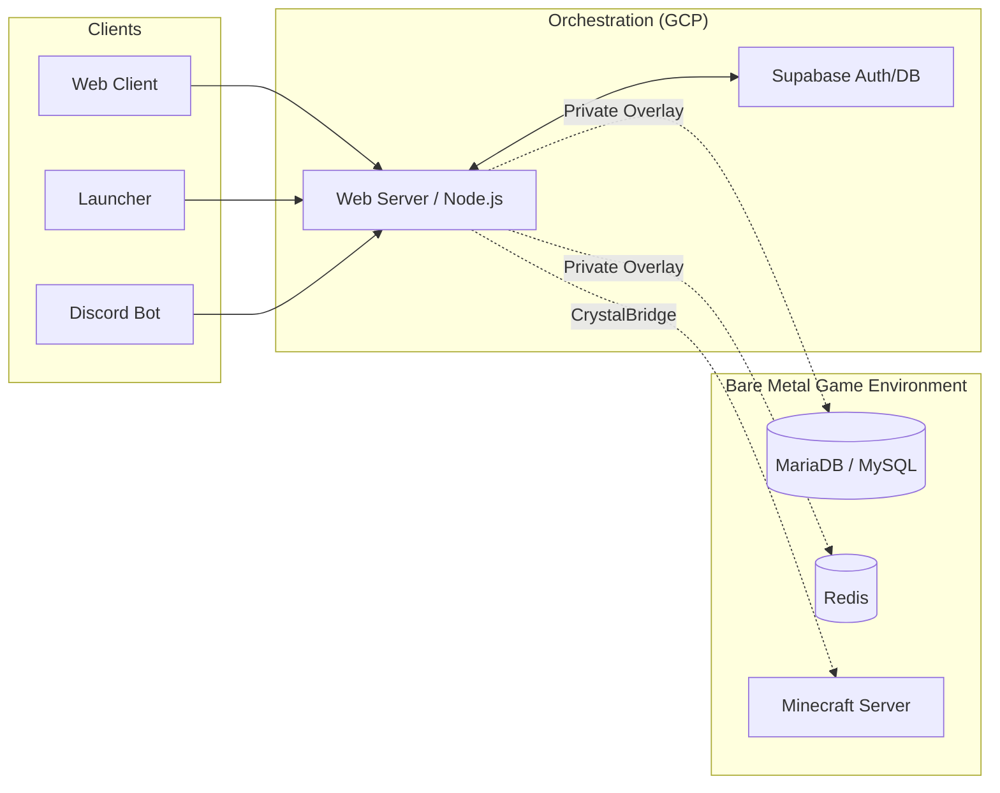

# ⚙️ CrystalTides Web Server

> **The high-performance orchestrator of the CrystalTides ecosystem.**


## 💎 Overview

El **CrystalTides Web Server** es el corazón lógico que une el mundo de Minecraft con la web y las aplicaciones móviles. Actúa como una capa de orquestación inteligente que garantiza la integridad de los datos, la seguridad en las comunicaciones y la sincronización en tiempo real entre **Supabase (Cloud)** y el hardware **Bare Metal**.

---

## 🌟 Key Responsibilities

- 🔌 **Unified API**: Punto de entrada único para `web-client`, `launcher` y `discord-bot`.
- 🌉 **CrystalBridge**: Ejecución de comandos asíncronos en Minecraft sin depender del protocolo RCON.
- 🔐 **Identity Proxy**: Sincronización de perfiles de Supabase con datos de juego de MariaDB/MySQL.
- ⚡ **Cache Layer**: Gestión de baja latencia mediante **Redis** para datos volátiles y pub/sub.
- 📡 **Webhooks & Integrations**: Orquestación de eventos de Discord y servicios de terceros.

---

## 🏗️ Architecture Role

El servidor web es el único componente autorizado para "cruzar el puente" entre el stack cloud y el entorno de juego protegido:



---

## 🛠️ Tech Stack

| Componente | Tecnología | Propósito |
| :--- | :--- | :--- |
| **Runtime** | [Node.js / Bun](https://bun.sh) | Entorno de ejecución rápido y eficiente |
| **Framework** | [Express](https://expressjs.com) | Routing y middleware de API |
| **Logic** | TypeScript | Tipado fuerte y seguridad en tiempo de desarrollo |
| **Security** | Helmet / HPP / Rate Limit | Hardening y protección de API |
| **Documentation** | Swagger / OpenAPI | Auto-documentación de endpoints |

---

## 🚀 Desarrollo & Despliegue

### 🛠️ Entorno Local

1.  **Instalar dependencias:**
    ```bash
    npm install
    ```
2.  **Correr en desarrollo:**
    ```bash
    npm run dev -w @crystaltides/server
    ```
3.  **Build de producción:**
    ```bash
    npm run build -w @crystaltides/server
    ```

### 🔐 Configuración (.env)

| Grupo | Variables Clave |
| :--- | :--- |
| **Cloud** | `SUPABASE_URL`, `SUPABASE_SERVICE_ROLE_KEY` |
| **Minecraft DB** | `MC_DB_HOST`, `MC_DB_USER`, `MC_DB_PASSWORD`, `MC_DB_NAME` |
| **CoreProtect** | `CP_DB_HOST`, `CP_DB_USER`, `CP_DB_PASSWORD`, `CP_DB_NAME` |
| **Cache** | `REDIS_HOST`, `REDIS_PORT`, `REDIS_PASSWORD` |

---

## 🎨 Future Implementation

- [ ] **Native Bun Migration**: Aprovechar el rendimiento de Bun para procesos WebSocket masivos.
- [ ] **SpacetimeDB Bridge**: Integrar la nueva arquitectura de base de datos reactiva para el staff panel.
- [ ] **Advanced Telemetry**: Panel Grafana/Prometheus integrado para monitoreo de TPS y salud del bridge.

---

> [!WARNING]
> **Aviso de Seguridad**: Este servicio maneja `SUPABASE_SERVICE_ROLE_KEY`. Nunca expongas este secreto en el cliente frontend. El acceso a MariaDB/Redis debe estar restringido a la red privada del servidor.

---

> [!NOTE]
> Este repositorio forma parte del monorepo de **CrystalTides**. Para más información sobre el ecosistema completo, visita el [README Principal](../../projects/README.md).
