# 🌉 CrystalBridge: Integración Web-Minecraft

**CrystalBridge** es la arquitectura propietaria de CrystalTides que permite la comunicación bidireccional entre el ecosistema Web (JavaScript/Node.js) y el Servidor de Minecraft (Java/Paper).

## 🛡️ ¿Por qué no usamos RCON?

El protocolo RCON estándar de Minecraft tiene limitaciones de seguridad:

1. Requiere abrir puertos adicionales en el firewall.
2. Es vulnerable a ataques de fuerza bruta.
3. Requiere que el servidor esté online en el momento exacto del comando.

**CrystalBridge** soluciona esto mediante el patrón "Inbox" (Bandeja de Entrada) o Cola de Comandos.

## ⚙️ Arquitectura Híbrida (v2.0)

Desde Enero 2026, CrystalBridge utiliza un patrón **Híbrido Event-Driven + Polling** para combinar baja latencia con máxima fiabilidad.

### Diagrama de Flujo

```mermaid
sequenceDiagram
    participant Web as 🌐 Web Server (Node)
    participant DB as 🗄️ MySQL (Queue)
    participant MC as 🎮 Minecraft (Plugin)

    Note over Web,MC: WebSocket Session Establicida (Puerto 3001)

    par Flujo de Comando
        Web->>DB: 1. INSERT INTO pending_commands
        Web->>MC: 2. WS Event: "REFRESH_COMMANDS"
    end
    
    rect rgb(30, 30, 40)
        Note right of MC: ⚡ Reacción Inmediata (<50ms)
        MC->>DB: 3. SELECT WHERE executed = 0
        DB-->>MC: [Listado Comandos]
        
        loop Por cada comando
            MC->>MC: 4. Ejecutar (Bukkit Dispatch)
            MC->>DB: 5. UPDATE executed = 1
        end
    end
    
    opt Fallo de Red / Reinicio
        Note over MC: 🔄 Mecanismo de Respaldo
        MC->>MC: Polling cada 10s (Backup)
    end
```

### Componentes

1.  **Web Server (Hub WebSocket)**:
    *   Escucha en puerto `3001`.
    *   Cuando un usuario actúa en la web, guarda el comando en la BD.
    *   Emite una señal `REFRESH_COMMANDS` a todos los clientes conectados.

2.  **Plugin Minecraft (Cliente WebSocket)**:
    *   Componente `WebBridgeModule`.
    *   Mantiene una conexión persistente con el Web Server.
    *   Al recibir la señal, consulta la base de datos *inmediatamente*, eliminando el retraso del polling tradicional.
    *   Mantiene un **Polling de Respaldo** (cada 10s) para garantizar ejecución si la conexión WS se pierde.

3.  **Base de Datos (Source of Truth)**:
    *   Garantiza que ningún comando se pierda, incluso si ambos servidores están offline.
    *   Mantiene el historial de auditoría.

## 🚀 Ventajas del Sistema v2.0

- **Latencia Cero**: La ejecución es prácticamente instantánea (Real-time Experience).
- **Resiliencia**: Si el socket falla, el sistema degrada elegantemente al polling tradicional.
- **Seguridad**: Se mantiene el modelo "Pull" (el servidor MC busca los datos), sin abrir puertos de entrada peligrosos (RCON) en el servidor de juego, ya que la conexión WS es saliente (Outbound) hacia el Web Server.

---

_Documentación actualizada el 10 de Enero de 2026._
