# ☁️ Supabase Integration

> **Backend-as-a-Service powering CrystalTides web platform**

Supabase provides authentication, database, storage, and realtime capabilities for the CrystalTides web ecosystem.

---

## 🎯 Overview

### What is Supabase?

Supabase is an open-source Firebase alternative built on PostgreSQL. It provides:
- **Authentication**: Email/password, OAuth (Discord, Google)
- **Database**: PostgreSQL with Row Level Security (RLS)
- **Storage**: File storage with CDN
- **Realtime**: WebSocket subscriptions for live data
- **Edge Functions**: Serverless functions

### Project Details

- **Project Name**: `[Your Project Name]`
- **URL**: `https://[your-project-id].supabase.co`
- **Region**: `[your-region]` (e.g., `us-east-1`, `eu-west-1`)
- **Plan**: Free Tier / Pro (500MB DB, 1GB Storage on free tier)

---

## 🔐 Authentication

### Providers

1. **Email/Password** - Primary registration method
2. **Discord OAuth** - Social login for community members
3. **Google OAuth** - Planned for future

### Authentication Flow

```mermaid
sequenceDiagram
    participant User as 👤 User
    participant Web as 🌐 Web Client
    participant SB as ☁️ Supabase Auth
    participant DB as 🗄️ PostgreSQL

    User->>Web: Enter credentials
    Web->>SB: signInWithPassword()
    SB->>SB: Verify credentials
    SB->>DB: Fetch user profile
    SB-->>Web: JWT Token + User Data
    Web->>Web: Store in localStorage
    Web-->>User: Redirect to dashboard
```



### Code Examples

**Sign Up**:
```typescript
const { data, error } = await supabase.auth.signUp({
  email: 'user@example.com',
  password: 'securePassword123',
  options: {
    data: {
      username: 'PlayerName'
    }
  }
})
```

**Sign In**:
```typescript
const { data, error } = await supabase.auth.signInWithPassword({
  email: 'user@example.com',
  password: 'securePassword123'
})
```

**Discord OAuth**:
```typescript
const { data, error } = await supabase.auth.signInWithOAuth({
  provider: 'discord',
  options: {
    redirectTo: `${window.location.origin}/auth/callback`,
    scopes: 'identify email guilds'
  }
})
```

---

## 🗄️ Database (PostgreSQL)

### Schema Overview


### Key Tables

#### `users`
```sql
CREATE TABLE users (
  id UUID PRIMARY KEY REFERENCES auth.users(id),
  email TEXT UNIQUE NOT NULL,
  username TEXT UNIQUE NOT NULL,
  discord_id TEXT UNIQUE,
  minecraft_uuid TEXT UNIQUE,
  avatar_url TEXT,
  role TEXT DEFAULT 'user',
  created_at TIMESTAMPTZ DEFAULT NOW()
);
```

#### `news`
```sql
CREATE TABLE news (
  id UUID PRIMARY KEY DEFAULT uuid_generate_v4(),
  title TEXT NOT NULL,
  content TEXT NOT NULL,
  author_id UUID REFERENCES users(id),
  category TEXT,
  published BOOLEAN DEFAULT FALSE,
  created_at TIMESTAMPTZ DEFAULT NOW()
);
```

#### `tickets`
```sql
CREATE TABLE tickets (
  id UUID PRIMARY KEY DEFAULT uuid_generate_v4(),
  user_id UUID REFERENCES users(id),
  title TEXT NOT NULL,
  description TEXT NOT NULL,
  status TEXT DEFAULT 'open',
  priority TEXT DEFAULT 'medium',
  created_at TIMESTAMPTZ DEFAULT NOW()
);
```

### Row Level Security (RLS)

**Users Table**:
```sql
-- Users can view their own profile
CREATE POLICY "Users view own profile"
  ON users FOR SELECT
  USING (auth.uid() = id);

-- Users can update their own profile
CREATE POLICY "Users update own profile"
  ON users FOR UPDATE
  USING (auth.uid() = id);

-- Admins can view all users
CREATE POLICY "Admins view all"
  ON users FOR SELECT
  USING (
    (SELECT role FROM users WHERE id = auth.uid()) = 'admin'
  );
```

**News Table**:
```sql
-- Anyone can view published news
CREATE POLICY "Public read published news"
  ON news FOR SELECT
  USING (published = true);

-- Admins can manage news
CREATE POLICY "Admins manage news"
  ON news FOR ALL
  USING (
    (SELECT role FROM users WHERE id = auth.uid()) IN ('admin', 'moderator')
  );
```

---

## 📦 Storage

### Buckets

1. **`avatars`** (Public)
   - User profile pictures
   - Max size: 2MB
   - Formats: `.jpg`, `.png`, `.webp`

2. **`skins`** (Public)
   - Minecraft skins (64x64)
   - Max size: 500KB

3. **`news-media`** (Public)
   - News article images
   - Max size: 5MB

### Upload Example

```typescript
// Upload avatar
const { data, error } = await supabase.storage
  .from('avatars')
  .upload(`${userId}/avatar.png`, file, {
    cacheControl: '3600',
    upsert: true
  })

// Get public URL
const { data: { publicUrl } } = supabase.storage
  .from('avatars')
  .getPublicUrl(`${userId}/avatar.png`)
```

---

## ⚡ Realtime Subscriptions

### Live News Feed

```typescript
const subscription = supabase
  .channel('news-updates')
  .on('postgres_changes', {
    event: 'INSERT',
    schema: 'public',
    table: 'news',
    filter: 'published=eq.true'
  }, (payload) => {
    console.log('New article:', payload.new)
    // Update UI in real-time
  })
  .subscribe()
```

### Ticket Status Updates

```typescript
supabase
  .channel(`ticket-${ticketId}`)
  .on('postgres_changes', {
    event: 'UPDATE',
    schema: 'public',
    table: 'tickets',
    filter: `id=eq.${ticketId}`
  }, (payload) => {
    // Notify user of status change
  })
  .subscribe()
```

---

## 🔗 MySQL Synchronization

### Account Linking Flow

```mermaid
sequenceDiagram
    participant Web as 🌐 Web Client
    participant SB as ☁️ Supabase
    participant WS as ⚙️ Web Server
    participant MySQL as 🗄️ MySQL
    participant MC as 🎮 Minecraft

    Web->>SB: User registers
    SB-->>Web: User ID created
    Web->>WS: Request link code
    WS->>MySQL: INSERT INTO universal_links
    MySQL-->>WS: Link code
    WS-->>Web: Display code
    
    MC->>MySQL: /link <code>
    MySQL->>WS: Webhook notification
    WS->>SB: UPDATE users SET minecraft_uuid
    WS->>MySQL: INSERT INTO linked_accounts
```



### Sync Code Example

```typescript
// Web Server (Node.js)
async function linkMinecraftAccount(supabaseUserId: string, linkCode: string) {
  // 1. Verify code in MySQL
  const [rows] = await mysqlPool.query(
    'SELECT minecraft_uuid FROM universal_links WHERE code = ?',
    [linkCode]
  )
  
  if (rows.length === 0) throw new Error('Invalid code')
  
  const { minecraft_uuid } = rows[0]
  
  // 2. Update Supabase
  await supabase
    .from('users')
    .update({ minecraft_uuid })
    .eq('id', supabaseUserId)
  
  // 3. Update MySQL
  await mysqlPool.query(
    'INSERT INTO linked_accounts (minecraft_uuid, web_user_id) VALUES (?, ?)',
    [minecraft_uuid, supabaseUserId]
  )
}
```

---

## 🛡️ Security Best Practices

### Environment Variables

```env
# Frontend (.env)
VITE_SUPABASE_URL=https://gyoqngvqhuxlcbivtfia.supabase.co
VITE_SUPABASE_ANON_KEY=eyJhbGc... # PUBLIC (safe to expose)

# Backend (.env)
SUPABASE_URL=https://gyoqngvqhuxlcbivtfia.supabase.co
SUPABASE_SERVICE_ROLE_KEY=eyJhbGc... # PRIVATE (never expose)
```

### Rate Limiting

- **Auth**: 30 attempts/hour per IP
- **Database**: 100 requests/second
- **Storage**: 50 uploads/minute

### CORS Configuration

Only allow requests from:
- `crystaltides.com`
- `localhost:5173` (development)

---

## 📊 Monitoring

### Current Usage

- **Database Size**: ~50MB / 500MB (10%)
- **Storage**: ~200MB / 1GB (20%)
- **Active Users**: ~50
- **Monthly Requests**: ~10,000

### Alerts

Set up alerts for:
- Database size > 450MB (90%)
- Storage > 900MB (90%)
- Error rate > 5%

---

## 🚀 Deployment

### Client Configuration

```typescript
// lib/supabaseClient.ts
import { createClient } from '@supabase/supabase-js'

export const supabase = createClient(
  import.meta.env.VITE_SUPABASE_URL,
  import.meta.env.VITE_SUPABASE_ANON_KEY
)
```

### Server Configuration

```typescript
// server/supabase.ts
import { createClient } from '@supabase/supabase-js'

export const supabaseAdmin = createClient(
  process.env.SUPABASE_URL!,
  process.env.SUPABASE_SERVICE_ROLE_KEY! // Bypass RLS
)
```

---

## 📚 Related Documentation

- [[Database Schema](./DATABASE_SCHEMA.md)] - Complete schema documentation
- [[Authentication](../api/AUTHENTICATION.md)] - Auth flows and JWT
- [[Web Client](../components/WEB_CLIENT.md)] - Frontend implementation
- [[Web Server](../components/WEB_SERVER.md)] - Backend integration

---

## 🔗 External Resources

- [Supabase Documentation](https://supabase.com/docs)
- [PostgreSQL RLS Guide](https://supabase.com/docs/guides/auth/row-level-security)
- [Realtime Guide](https://supabase.com/docs/guides/realtime)

---

_Last updated: January 10, 2026_
