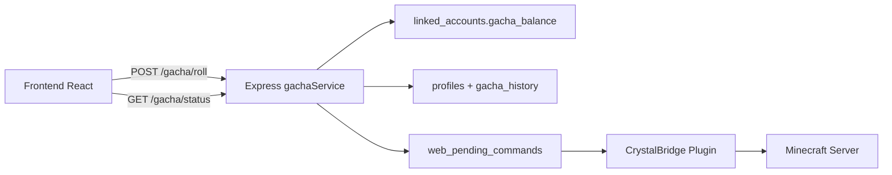

# KilluCoin Gacha

El **KilluCoin Gacha** es el minijuego principal de gamificación en la web de CrystalTides, diseñado para recompensar la fidelidad de los usuarios con premios dentro del juego.

## Experiencia de Usuario (UX)

- **Interfaz Visual**: Sistema multi-tier (Bronze → Iridium + Ultra evento) con animaciones GSAP.
- **Acceso**: Requiere cuenta logueada y Minecraft vinculado.
- **Tirada gratis**: 1 roll gratis por tier en la primera visita; después, cooldown por tier antes del siguiente roll gratis.
- **Tiradas de pago**: Cada tier tiene un coste en KilluCoins (`gacha_balance`).

## Integración Técnica

### Capas

1. **Frontend** ([`apps/web-client/src/pages/Gacha/`](../../apps/web-client/src/pages/Gacha/))
   - Config compartida desde `@crystaltides/shared`.
   - Consulta `/gacha/status/:userId` para balance, cooldowns y tiers desbloqueados.
   - Envía `forceDeduction` (panel admin) al backend.

2. **Backend** ([`apps/web-server/services/gachaService.ts`](../../apps/web-server/services/gachaService.ts))
   - Config canónica en [`packages/shared/src/gacha.ts`](../../packages/shared/src/gacha.ts).
   - RNG ponderado con normalización dinámica (`selectWeightedReward`).
   - Balance canónico en MySQL `linked_accounts`, sincronizado a Supabase `profiles`.
   - Deducción atómica **antes** de entregar premios; reembolso si falla la entrega.
   - Tier **Ultra**: requiere `unlocked_tiers` en MySQL (escaneado por GachaModule) o bypass admin.

3. **Entrega** (CrystalBridge)
   - Comandos: `eco give`, `give <item> <count>`, `xp give`.
   - Items con NBT se parsean correctamente (sin prefijo `minecraft:` incorrecto).

## Cooldowns por Tier (horas)

| Tier    | Cooldown | Coste KC   |
| ------- | -------- | ---------- |
| Bronze  | 6        | 100        |
| Silver  | 18       | 1.000      |
| Gold    | 34       | 10.000     |
| Emerald | 48       | 100.000    |
| Diamond | 72       | 1.000.000  |
| Iridium | 96       | 10.000.000 |
| Ultra   | Evento   | 0          |

## Endpoints

| Método | Ruta                         | Descripción                             |
| ------ | ---------------------------- | --------------------------------------- |
| GET    | `/api/gacha/tiers`           | Lista de tiers y premios (público)      |
| GET    | `/api/gacha/status/:userId`  | Balance, cooldowns, tiers desbloqueados |
| POST   | `/api/gacha/roll`            | Ejecutar tirada(s), máx. 10 por request |
| GET    | `/api/gacha/history/:userId` | Historial reciente                      |

## Premios

Definidos en `@crystaltides/shared` (`GACHA_TIERS`). Rareza por tier: common, rare, epic, legendary, mythic.

_Documentación actualizada — junio 2026._
